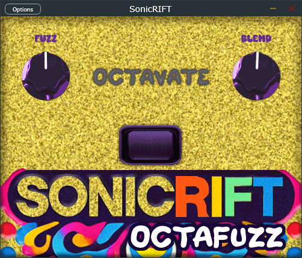

# SonicRIFT Octave Fuzz Pedal

**SonicRIFT Octave Fuzz** is a powerful guitar effects pedal that combines fuzz distortion with an octave-up effect for a versatile and dynamic sound. Whether you're seeking warm, saturated fuzz or sharp, high-pitched harmonics, SonicRIFT offers the sonic depth and control to shape your perfect tone.



## Features

- **Fuzz Distortion**: Smooth, heavy fuzz for a thick and aggressive sound.
- **Octave-Up Mode**: Engage the "OCTAVATE" (octave-up) effect to add harmonic overtones, creating a sharp and searing top-end.
- **Blend Control**: Mix the dry and wet signals to customize your fuzz intensity.
- **Fuzz Control**: Boost the input signal for more aggressive clipping and distortion.
- **Low-Pass Filtering**: Automatically applied when the octave-up mode is active, smoothing harsh high frequencies for a refined tone.

## How It Works

- **Fuzz Mode**: When the octave-up effect is off, SonicRIFT functions as a traditional fuzz pedal, delivering warm and rich tones through a soft-clipping distortion circuit using the `tanh` function.
  
- **Octave-Up Mode**: Activating the octave-up effect rectifies the signal, adding an octave-up harmonic overtone. This mode automatically applies a low-pass filter to smooth out the high frequencies and produce a balanced and full sound.

## Controls

- **Fuzz Amount**: Adjust the intensity of the fuzz distortion.
- **OCTAVATE**: Toggle the octave-up effect on or off.
- **Blend**: Control the mix between the dry (clean) signal and the wet (fuzzed) signal.

## Installation Instructions for **SonicRIFT Octave Fuzz** Plugin

### Prerequisites

Ensure you have the following installed before working with the **SonicRIFT Octave Fuzz** project:

- **JUCE Framework**: JUCE is a widely-used C++ framework for building cross-platform audio applications. To install JUCE:
  
  1. **Download JUCE**:
     - Head over to the [JUCE website](https://juce.com/get-juce) and download the latest version of JUCE.
  
  2. **Install JUCE**:
     - Unzip the JUCE package and move it to your desired directory. For example:
       ```
       /Users/yourname/Documents/JUCE
       ```

  3. **ProJucer**: The project uses a `.jucer` file to define project settings. You will use JUCE's project manager called **ProJucer** to open and export the project to your preferred IDE (e.g., Xcode or Visual Studio).

### Setting Up the SonicRIFT Project

1. **Clone the Repository**:
   - Open your terminal and clone the repository:
     ```bash
     git clone https://github.com/JoePhelan16/SonicRIFT-Octave-Fuzz-Audio-Plugin.git
     ```
   - Navigate to the folder containing the cloned repository:
     ```bash
     cd SonicRIFT-Octave-Fuzz-Audio-Plugin
     ```

2. **Open the Project in ProJucer**:
   - Launch the **ProJucer** app from your JUCE installation folder.
   - Inside ProJucer, click **File > Open** and navigate to the **`SonicRIFT.jucer`** file inside the cloned repository.
   - The project will open, showing all the settings and modules for the plugin.

3. **Configure and Export the Project**:
   - In ProJucer, select your desired IDE from the "Exporters" section on the left sidebar (e.g., Xcode for macOS, Visual Studio for Windows).
   - Hit **Save and Open in IDE** to generate project files and open the project in your chosen IDE.

4. **Build the Project**:
   - Once the project is open in your IDE, build the project.
   - This will compile the plugin into a `.vst3` file (or other formats like `.au` for macOS, depending on your selected exporter settings).

### Installing the Plugin in Your DAW

After building the project, you'll get a compiled plugin file (e.g., `SonicRIFT.vst3`). To use this plugin in your DAW:

1. **Copy the Plugin to the Correct Directory**:
   - **macOS**: Copy the `.vst3` file to `/Library/Audio/Plug-Ins/VST3/`.
   - **Windows**: Copy the `.vst3` file to `C:\Program Files\Common Files\VST3\`.

2. **Launch Your DAW**:
   - Restart your DAW and look for the **SonicRIFT Octave Fuzz** plugin in your plugin library.

3. **Enjoy SonicRIFT**:
   - Load the plugin onto an audio track and start tweaking the fuzz and octave-up controls to explore its powerful sound-shaping features.

--- 

These instructions are now tailored for your project on GitHub and include specific steps to set up and export the JUCE project.

## Install built VST3

To install the SonicRIFT Octave Fuzz as a VST3 plugin:

1. Download the `.vst3` file from the repository's [Releases](https://github.com/your-repo/releases) page.
2. Copy the `.vst3` file to the appropriate directory on your system:

   - **macOS**: `/Library/Audio/Plug-Ins/VST3/`
   - **Windows**: `C:\Program Files\Common Files\VST3\`

3. Restart your DAW (Digital Audio Workstation) and search for "SonicRIFT Octave Fuzz" in your plugin library.

## Usage

1. Load the **SonicRIFT Octave Fuzz** plugin in your preferred DAW.
2. Use the **Fuzz Amount**, **Blend**, and **Gain** knobs to shape your sound.
3. Enable the **Octave-Up Mode** for added harmonic overtones.
4. Experiment with the controls to find the perfect balance for your tone.

## License

This project is licensed under the MIT License. See the [LICENSE](LICENSE) file for details.

---

### Credits

This project utilizes the following open-source libraries:

- [JUCE Framework](https://juce.com/) - For building cross-platform audio applications.

